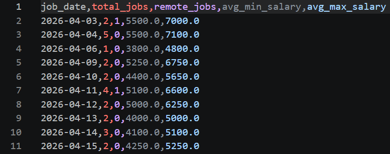
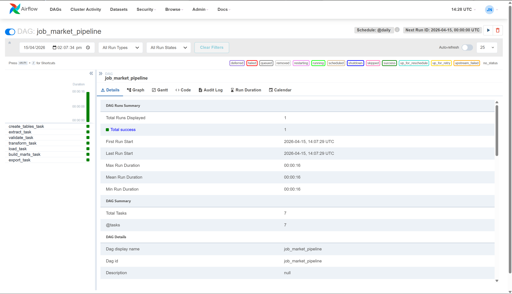

# End-to-End Job Market ETL Pipeline with Apache Airflow

## Overview
This project is an end-to-end ETL pipeline built with Apache Airflow, Python, PostgreSQL, and Docker. It ingests raw job listing data from CSV files, validates and transforms the data, loads it into PostgreSQL, builds analytics-ready marts, and exports final reporting outputs.

The project was designed to simulate a production-style batch pipeline with orchestration, data validation, transformation, database loading, and reporting.

## Tech Stack
- Apache Airflow
- Python
- PostgreSQL
- Docker Compose
- Pandas
- SQL

## Pipeline Flow
Raw CSV → Extract → Validate → Transform → Load to PostgreSQL → Build marts → Export CSV

## Features
- Orchestrated workflow using Apache Airflow DAGs
- Data validation for required fields and duplicate records
- Salary parsing and skill extraction from job descriptions
- PostgreSQL staging and analytics marts
- Export of final reporting output as CSV
- Dockerized local setup for reproducible execution
- Synthetic job data generator for creating sample input files

## Project Structure
```text
job-market-pipeline/
│
├── dags/                  # Airflow DAG definitions
├── src/                   # Python ETL scripts
├── sql/                   # SQL schema and mart definitions
├── data/
│   ├── raw/               # Input CSV files
│   ├── processed/         # Intermediate processed files
│   └── exports/           # Final exported outputs
├── docker-compose.yml
├── requirements.txt
└── README.md
```
## How to Use This Repository

### Prerequisites
Make sure the following are installed:
- Docker Desktop
- Python 3.10+ 
- Git

### 1. Clone the repository
```bash
git clone https://github.com/MesutNeozil/job-market-pipeline.git
cd job-market-pipeline
```
### 2. Generate a raw job data file
First, edit `num_rows` in `src/generate_jobs.py` accordingly. Then run:
```bash
python src/generate_jobs.py
This creates a timestamped CSV in `data/raw` (eg. `data/raw/jobs_2026_04_15_214312.csv`).
```
### 3. Update the input file used by DAG
In `dags/job_market_pipeline.py`, find 'extract_task` and update the file path accordingly.

### 4. Start the services
```bash
docker compose up --build
This starts:
- PostgreSQL
- Airflow webserver
- Airflow scheduler
- Airflow init service
```
### 5. Open the Airflow UI
Go to http://localhost:8080 and log in with:
- Username: airflow
- Password: airflow

### 6. Trigger pipeline
In the Airflow UI:
- Locate the `job_market_pipeline` DAG
- Unpause it if needed
- Trigger a run manually

### 7. Check the outputs
After a successful run, check:
- `data/processed/` for intermediate files
- `data/exports/` for final exported outputs
- Main exported file `data/exports/mart_jobs_daily.csv`

#### Sample `mart_jobs_daily.csv`

#### Successful run


### 8. Stop the services
```bash
docker compose down
```